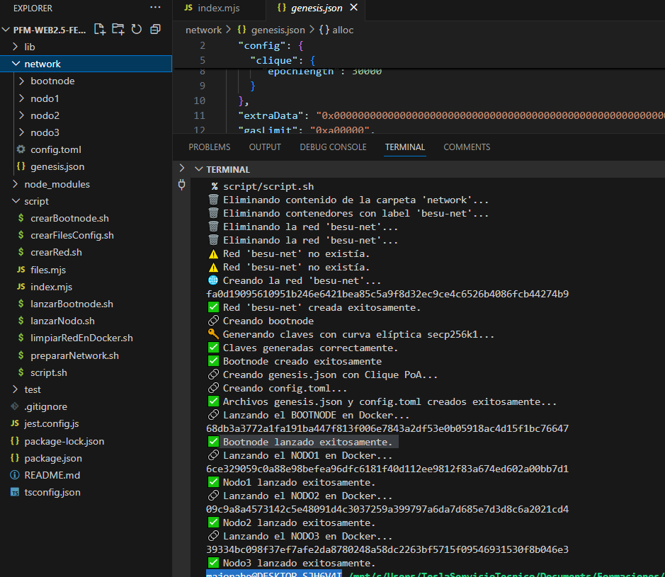

# 🚀Project Hyperledger Besu Automation

## 📌Contexto
Este proyecto tiene como objetivo automatizar la creación y gestión de una red blockchain basada en Hyperledger Besu, utilizando Docker para desplegar nodos y facilitar su interacción mediante una API REST y una interfaz gráfica.

Con este proyecto, se profundiza en:
✅ La configuración y operación de nodos en Hyperledger Besu
✅ La creación y administración de redes internas con Docker
✅ El uso de scripts y TypeScript para la gestión programática de la red

## 🛠️Tecnologías Utilizadas
Frontend: React (NextJS)
Backend: NodeJS con TypeScript
Contenedorización: Docker
Blockchain Framework: Hyperledger Besu con el protocolo Clique
Sistema Operativo: WSL en Windows

***

## 📌Tareas llevadas a cabo hasta el momento
1️⃣ Script para desplegar múltiples nodos con Docker
Se ha desarrollado un script automatizado para iniciar múltiples nodos en la red con comandos Docker.

📌 Vista del script en acción:


🔗 Detalles en video:

🎥[ProyBesu.Script Parte 1 ](https://www.loom.com/share/fd374917eff54865ae687fd43c1ada59?sid=dcad4971-9acd-4aef-8f9f-9885bc4a693e)
🎥[ProyBesu.Script Parte 2 ](https://www.loom.com/share/244a1c4fb19140118f4a00d5ce6bdbf4?sid=4eb2697b-51e1-4e95-b365-149359aaac5d)


2️⃣ Biblioteca en TypeScript para gestión de nodos y redes
Se ha implementado una librería en TypeScript que simplifica la creación y administración de nodos y redes en Hyperledger Besu.

3️⃣ Pruebas automatizadas para validación de nodos
Se han desarrollado pruebas automatizadas con Jest para validar la correcta creación y configuración de la red y sus nodos.

***

## 🚀 Cómo levantar la red desde el script
Ejecuta el siguiente comando en la terminal:
```sh 
./script/script.sh 
```

## ✅ Pruebas de la librería
Puedes ejecutar las pruebas unitarias de la automatización de la red con Jest:
```sh 
npx jest test/netManager.test.ts
npx jest test/countManager.test.ts
```

### 📄 Notas
🔹 Asegúrate de que Docker está en ejecución antes de iniciar el nodo.
🔹 Para verificar que Hyperledger Besu está instalado, ejecuta:
```sh 
besu --version
```
🔹 Deberías obtener una respuesta similar a esta:
```sh 
besu/v23.10.0/linux-x86_64/openjdk-java-21
```
