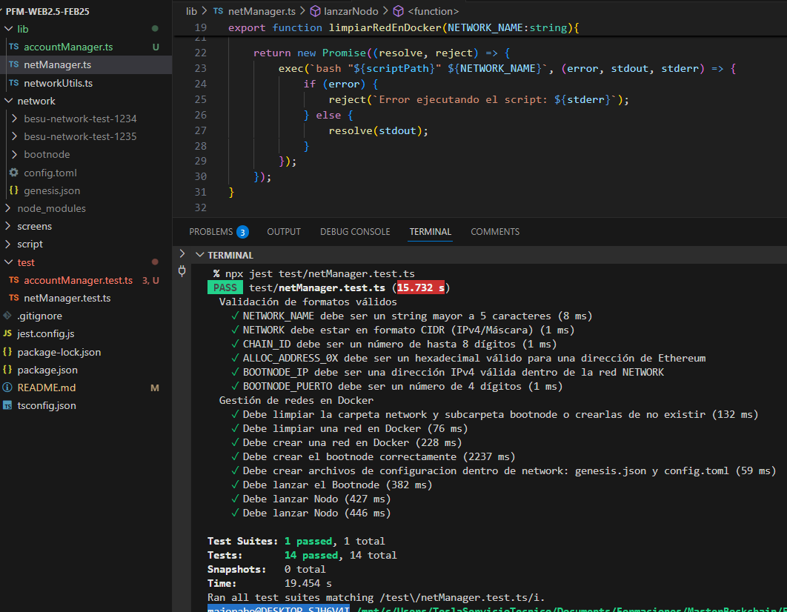
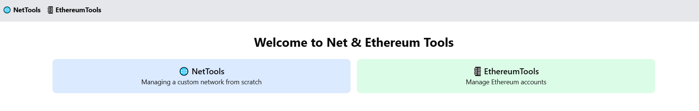
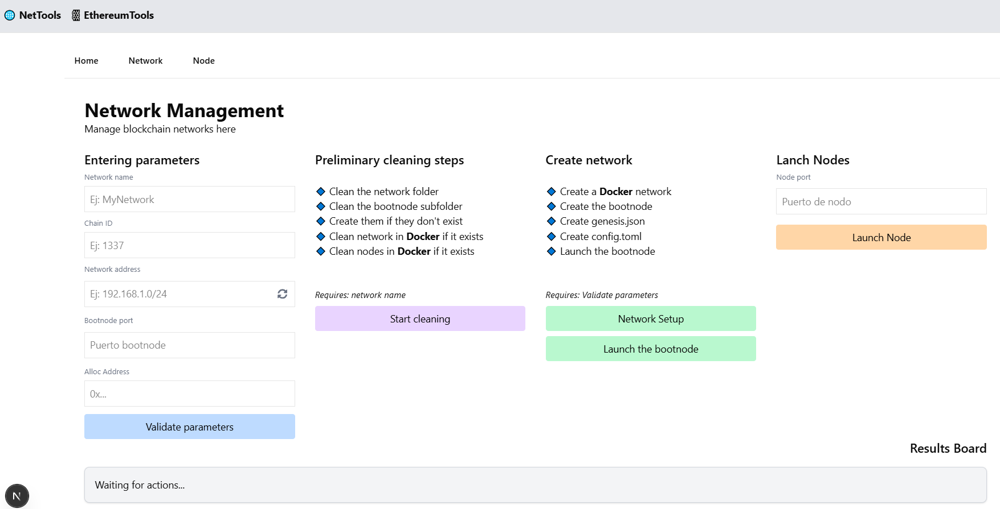
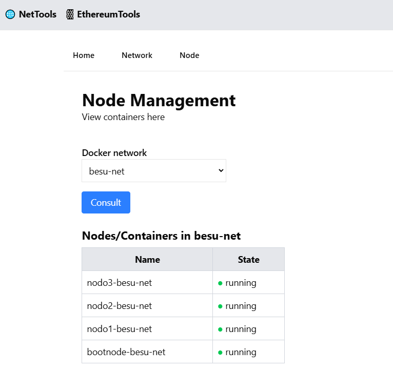
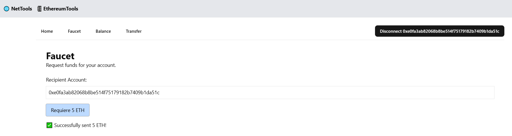
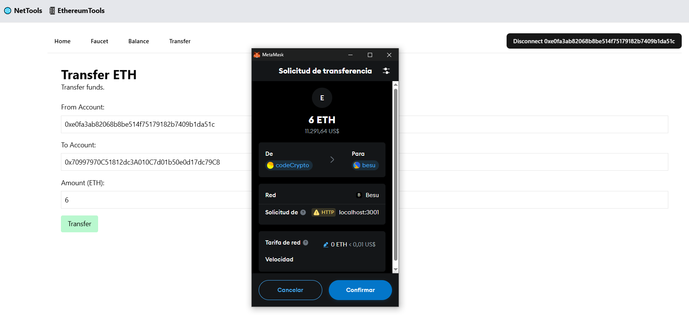
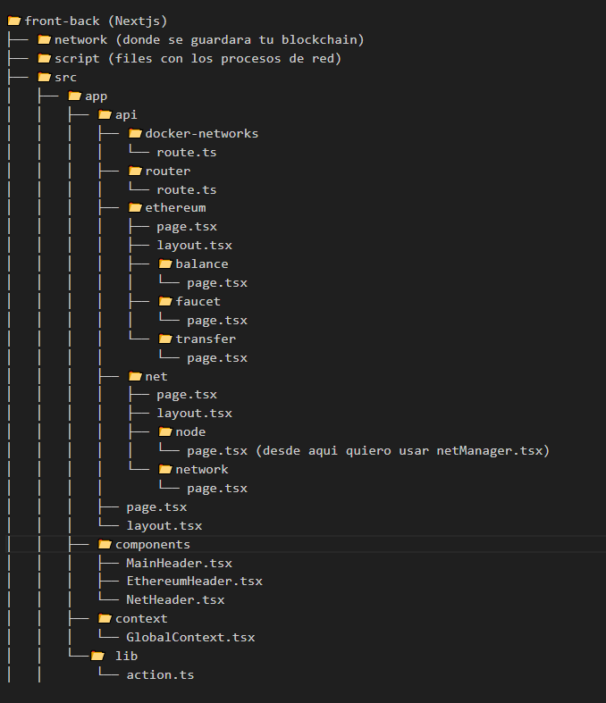

# 🚀Project Hyperledger Besu Automation

## 📌Contexto
Este proyecto tiene como objetivo automatizar la creación y gestión de una red blockchain basada en Hyperledger Besu, utilizando Docker para desplegar nodos y facilitar su interacción mediante una API REST y una interfaz gráfica.

Con este proyecto, se profundiza en:
- ✅ La configuración y operación de nodos en Hyperledger Besu<br>
- ✅ La creación y administración de redes internas con Docker<br>
- ✅ El uso de scripts y TypeScript para la gestión programática de la red

## 🛠️Tecnologías Utilizadas
* Frontend: React (NextJS)
* Backend: NodeJS con TypeScript
* Contenedorización: Docker
* Blockchain Framework: Hyperledger Besu con el protocolo Clique
* Sistema Operativo: WSL en Windows

***

## 📌Etapa 1. Tareas Backend
### 1️⃣ Script para desplegar múltiples nodos con Docker
Se ha desarrollado un script automatizado para iniciar múltiples nodos en la red con comandos Docker.

📌 Vista del script en acción:<br>
<br>
### 🔗 Detalles en video:
* 🎥[ProyBesu.Script Parte 1 ](https://www.loom.com/share/fd374917eff54865ae687fd43c1ada59?sid=dcad4971-9acd-4aef-8f9f-9885bc4a693e)
* 🎥[ProyBesu.Script Parte 2 ](https://www.loom.com/share/244a1c4fb19140118f4a00d5ce6bdbf4?sid=4eb2697b-51e1-4e95-b365-149359aaac5d)


### 2️⃣ Biblioteca en TypeScript para gestión de nodos y redes
Se ha implementado una librería en TypeScript que simplifica la creación y administración de nodos y redes en Hyperledger Besu.

### 3️⃣ Pruebas automatizadas para validación de nodos
Se han desarrollado pruebas automatizadas con Jest para validar la correcta creación y configuración de la red y sus nodos.

📌 Vista de las pruebas en acción:<br>
```sh 
npx jest test/netManager.test.ts
```
<br>
### 🔗 Detalles en video:
* 🎥[ProyBesu.Lib/Test Parte 1](https://www.loom.com/share/de562deee4fd46eb8e5dae6bcb9c1da5?sid=4b1a4b2d-6f67-45c8-89f8-b0f9278b145a)
* 🎥[ProyBesu.Lib/Test Parte 2](https://www.loom.com/share/1362437658e849ba8aeeccfbd0abcd7c?sid=777d8f50-a2a3-4205-97bf-f0b678e1cbff)
***

### 🚀 Cómo levantar la red desde el script
Ejecuta el siguiente comando en la terminal:
```sh 
./script/script.sh 
```

### ✅ Pruebas de la librería
Puedes ejecutar las pruebas unitarias de la automatización de la red con Jest:
```sh 
npx jest test/netManager.test.ts
npx jest test/accountManager.test.ts
```

### 📄 Notas
- 🔹 Asegúrate de que Docker está en ejecución antes de iniciar el nodo.
- 🔹 Para verificar que Hyperledger Besu está instalado, ejecuta:
```sh 
besu --version
```
- 🔹 Deberías obtener una respuesta similar a esta:
```sh 
besu/v23.10.0/linux-x86_64/openjdk-java-21
```
- 🔹 Puedes revisar el estado de la red y de las cuentas usando Curl, ejecutando por ejemplo:
```sh 
curl -X POST http://localhost:2819 
  -H "Content-Type: application/json" \
  --data '{"jsonrpc":"2.0","method":"eth_getBalance","params":["0x70997970C51812dc3A010C7d01b50e0d17dc79C8", "latest"],"id":1}'
```


## 📌Etapa 2. Panel de Control
### 1️⃣ Pantalla de Inicio 
La app distingue dos grupos: recursos para la gestión de redes personalizadas y recursos para gestionar cuentas Ethereum.

📌 Interfaz de inicio:<br>
<br>

### 2️⃣ Recorrido por NetTools
En esta sección, pestaña Network, podras crear una red desde cero, ingresando los parámetros más relevantes que la conforman: nombre, chainId, dirección de red (y calcular de forma correcta la ip de bootnode que tendra tu red), e incluso ingresar una cuenta a la que se le asignaran 200 ETH de fondos.Luego en la pestaña Node, podras consultar los nodos (contenedores) que tus redes tienen asociados. 

📌 Network Management - Pestaña Network<br>
<br>

📌 Node Management - Pestaña Node<br>
<br>

### 🔗 Detalles en video:
* 🎥[ProyBesu.NetTools. Parte 1](https://www.loom.com/share/e301b07533d24488935e5de3ee805dfd?sid=823abf42-4e8b-4660-9ef9-a8aef840bcc2)
* 🎥[ProyBesu.NetTools. Parte 2](https://www.loom.com/share/5b5a133fd55d449f8fa82d79306d0c1d?sid=7810d5cc-3c95-40cc-8143-e742156250f0)
* 🎥[ProyBesu.NetTools. Parte 3](https://www.loom.com/share/7a12faed6e704826a8a2ff79bc038435?sid=502fdb49-9460-40da-9034-58444db94466)
***

### 3️⃣ Recorrido por EthereumTools
En esta sección, podras conectarte a una cuenta Ethereum desde metamask y elegir que hacer: 
- 🔹 Faucet: Pedir fondos (5 ETH por cada solicitud)
- 🔹 Balance: Revisar el balance de tu cuenta
- 🔹 Transfer: Transferir fondos de una cuenta a otra

📌 Veamos EthereumTools en acción<br>
<br>
<br>
<br>

### 🔗 Detalles en video:
* 🎥[ProyBesu.EthereumTools](https://www.loom.com/share/75383011c2cf4f808db6b6219d7fe913?sid=91c36b5a-3d74-4856-b5d8-16d4b92418a9)
***

## 🚀Lo relevante que tienen que conocer de la estrutura el proyecto
<br>

